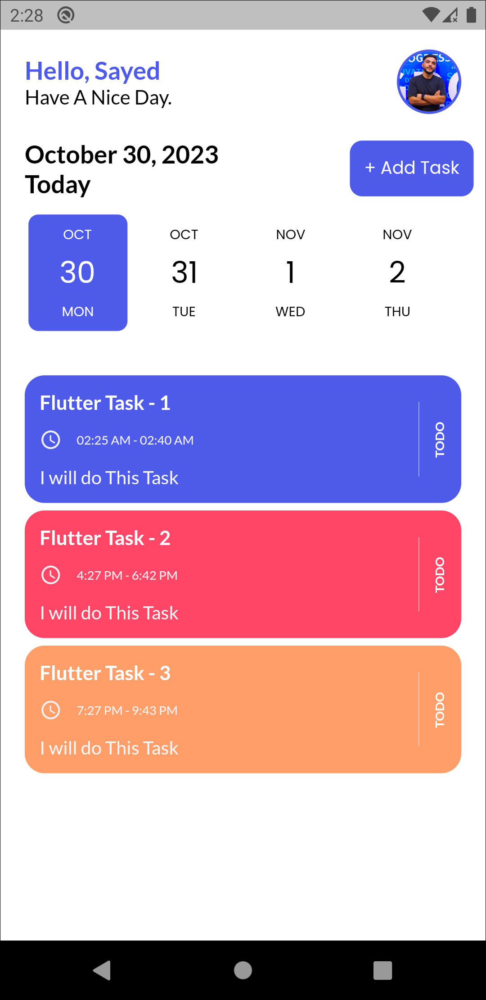
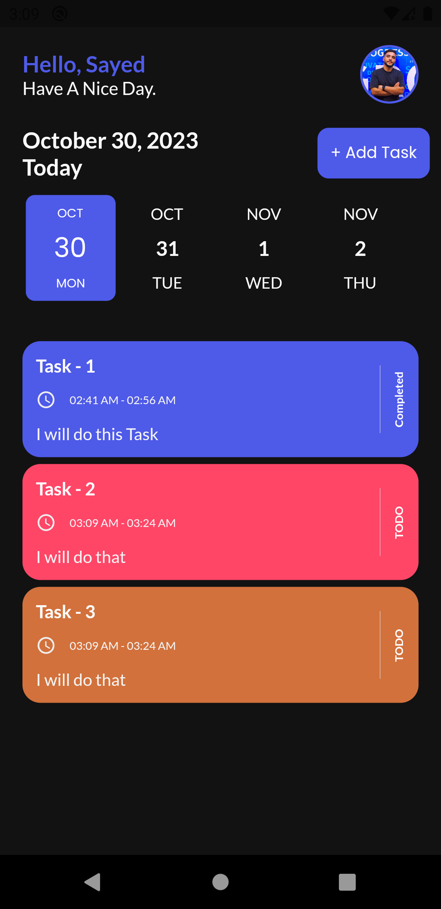

#  Taskati App

this is a simple task management mobile application built with Flutter.  
The app allows users to create, edit, and manage their daily tasks with a clean UI and a Dark Mode option for better user experience.

-------------

##  Features
-  Add, edit, and delete tasks  
-  Profile section with user account name & profile picture
-  Dark Mode & Light Mode support  
-  Simple, clean, and modern design  

------------

##  Screenshots

| Light Mode | Dark Mode |
  |  |

---

##  Tech Stack
- Flutter & Dart – UI & Logic

# Install dependencies
flutter pub get

# Run the app
flutter run
